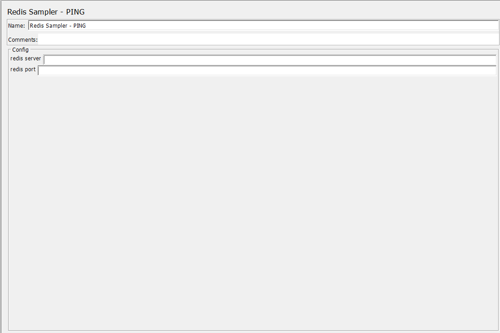
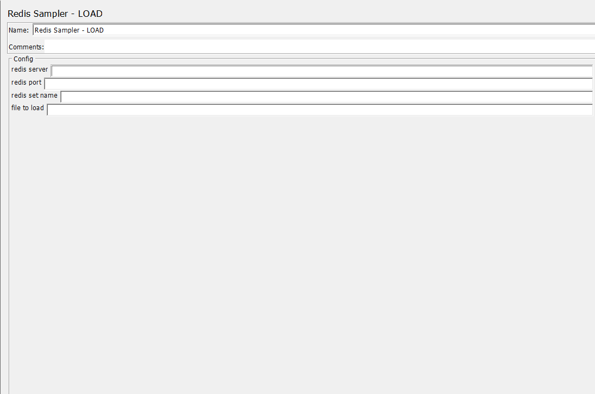
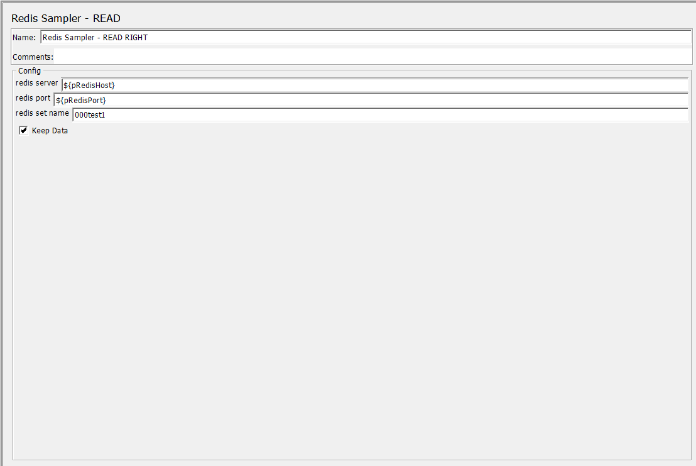
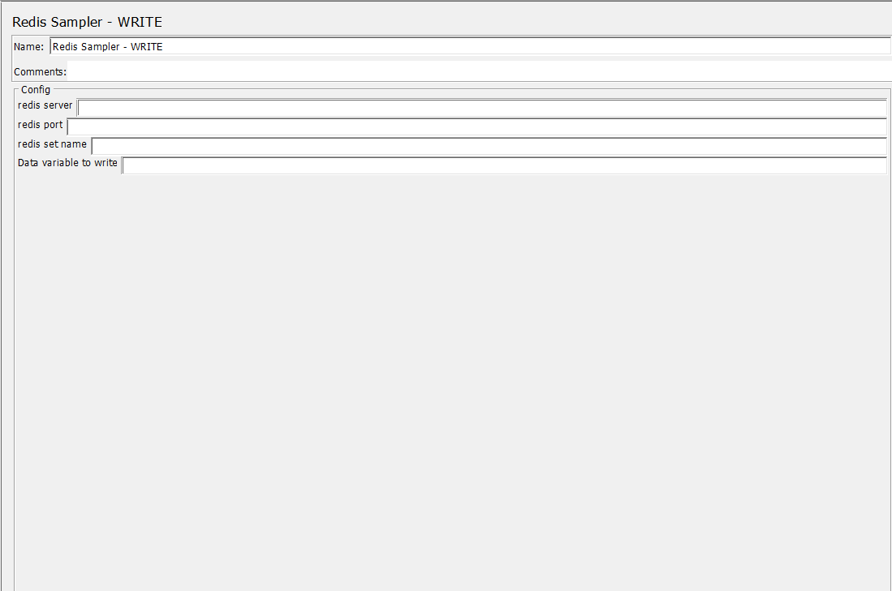

# jmeter-redis-plugin
---
## What is jmeter

The Apache [Jmeter](https://jmeter.apache.org/ "Jmeter") application is open source software, a 100% pure Java application designed to load test functional behavior and measure performance.

## What is jmeter plugin

JMeter [Plugins](https://jmeter-plugins.org/ "Plugins") are software components used to customize programs by extending abilities and inserting functions.

## What is redis

[Redis](https://redis.io/ "Redis") is an open source, in-memory data structure store, used as a database, cache, and message broker.

## What is Jedis?

[Jedis](https://github.com/redis/jedis "Jedis") is a Java client for [Redis](https://github.com/redis/redis "Redis") designed for performance and ease of use.

## jmeter Redis Sample Functions
---
# Redis Sample - Ping

Pings a redis server, 
returns 200 if sucessfull.

Takes two inputs
1. Redis Server - IP or DNS of the redis server
2. Redis Port - port number of the redis server.

Utilises redis function [PING](https://redis.io/commands/ping/ "PING")

# Redis Sample - Load

Load a data file into the redis server
returns 200 if sucessfull.
returns set name and number of records loaded.

Takes four inputs
1. Redis Server - IP or DNS of the redis server
2. Redis Port - port number of the redis server
3. Redis Set name - the name of the redis set to store the file. Will be deleted prior to loading
4. File to load - name of the file to load

Utilises redis functions
1. [SADD](https://redis.io/commands/sadd/ "SADD") 
2. [PIPELINE](https://redis.io/docs/manual/pipelining/ "PIPELINE") 

# Redis Sample - Read

Read a single data element from a redis set, 
returns 200 if sucessfull.
returns data in response body field for post processing
returns no more data in response body field if set is empty

Takes four inputs
1. Redis Server - IP or DNS of the redis server
2. Redis Port - port number of the redis server
3. Redis Set name - the name of the redis set to store the file. Will be deleted prior to loading
4. Keep data in redis set, check for yes, unchecked for no

Currently only supports random reads.

Utilises redis functions
1. [SRANDMEMBER](https://redis.io/commands/sadd/ "SRANDMEMBER") - data remains
2. [SPOP](https://redis.io/commands/sadd/ "SPOP") - data is removed

# Redis Sample - Write

Writes a single data element to a redis set
returns 200 if sucessfull.
Returns setname and data loaded in response body

Takes four inputs
1. Redis Server - IP or DNS of the redis server
2. Redis Port - port number of the redis server
3. Redis Set name - the name of the redis set to store the file. Will be deleted prior to loading
4. Data Variable to write - the data or variable to be written

Utilises redis function [SADD](https://redis.io/commands/sadd/ "SADD") 

